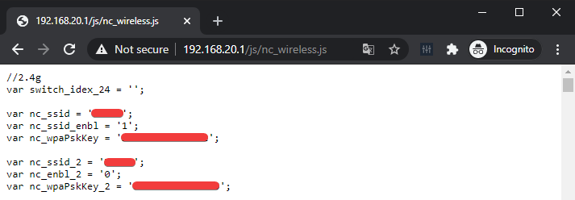
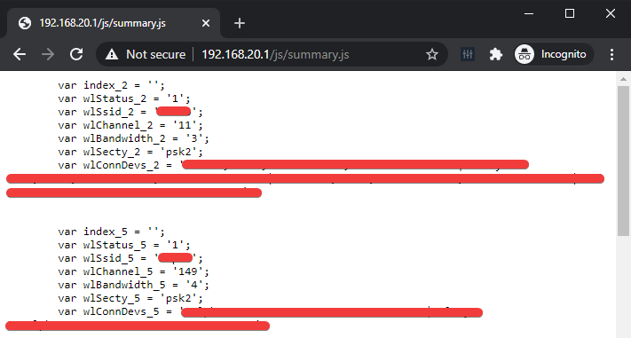

## Explanation

The following is an explanation of a security vulnerability I found in the NetComm NF18ACV Router.\
The exploit is active as of the router's most recent firmware Version NC2-R6B017 released on 09/01/2020.\
The vulnerability is to do with the way that the router fails to authenticate users when requesting files containing its network settings. This information contains the likes of network SSIDs, network passwords and MAC addresses that can all be accessed in plaintext over HTTP. This information transfer is not correctly secured, and a network user without router panel credentials can quite easily acquire this information.

## Threat

As it allows an individual with very low effort, low skill, and no external tools to take advantage of, this vulnerability results in quite a high threat level.

While most users would mostly be secured, there are situations where a user would expect to be somewhat protected, but are actually leaving themselves vulnerable to attack.

If the router panel's default login credentials are changed, a user may think that they are securing the network information from other broadcasts, this is untrue with this vulnerability.

Any network that has an unsecured guest network (the default settings for a guest network on this router), is vulnerable to this exploit and could enable a user to elevate themselves to a different secured network. This also applies to secured networks and getting credentials to access one from another.

Another situation where a network would be vulnerable would be if it had enabled WAN access over HTTP on the router. With this enabled, any user over the internet with access to the network's public IP address would be able to also conduct this exploit and acquire sensitive information remotely, irrespective of a secured router panel.

Clearly this is an issue with how the router handles the security of its files when sending them to a client, lacking the correct authentication and allowing unauthenticated users the ability to view these files.

## Reproduction Steps

The only requirement is to be on a single network being broadcast by the router, this includes guest networks.

In a browser, the same way you would reach the admin panel, navigating to the following pages will result in confidential information being exposed to the user. No authentication is required. The two JavaScript files are accessible globally on the network and feature network SSIDs and passwords presented in plaintext.

- http://192.168.20.1/js/nc_wireless.js

- http://192.168.20.1/js/summary.js

## Conclusion

If other routers of the same product family also feature the same router software, there is also the possibility that they are also vulnerable to the insecurity featured.

Possible prevention of being impacted by this vulnerability would be to ensure that WAN over HTTP is disabled on the router and that all networks are secured, including guest networks.

In no way is this a complete assessment of the security of this product and is this issue only limited to the aforementioned situations, however reasonable precautions should be taken to protect oneself.

## Update (2020/12/01)

I privately disclosed this security vulnerability with NetComm and provided the steps to reproduce the vulnerability.

I was further requested to participate in the testing of their software fix for the security vulnerability.

As of the 26th of November 2020, the latest firmware release for the NF18ACV system (Version NC2-R6B021) features the fix for this issue as well as other improvements. If you are running a firmware version that is not the latest, it is highly recommended to you update to the latest release.

* The NF18ACV Version NC2-R6B021 release notes can be found [here](https://support.netcommwireless.com/api/Media/Firmware/8e5cc143-2cef-47d3-ad32-34ab46a81570?Product=NF18ACV-NC2%20Firmware%20Release%20Notes.pdf)
* The latest firmware version download can be found [here](https://support.netcommwireless.com/products/nf18acv)